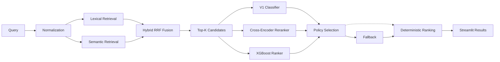

# Trendyol Search Relevance Intelligence

Independent research into query-product relevance classification, retrieval, ranking, cross-encoder reranking, and reproducible ML evaluation — built on a public competition snapshot. This project does not imply Trendyol or TEKNOFEST endorsement.

## Why this project matters

Search relevance is a core information-retrieval problem: given a user query and a product catalogue, rank products so the most relevant results appear first. This repository demonstrates the full research lifecycle — from a sparse classification baseline (V1) through semantic retrieval (V3), end-to-end orchestration (V4), and cross-encoder reranking (V5) — with explicit governance decisions at every stage.

## Version timeline

| Version | Focus | Status |
|---|---|---|
| V1 | TF-IDF + Logistic Regression classification | Verified champion |
| V2 | Tree models and XGBRanker ranking research | Not promoted |
| V2.1 | Multi-seed robust evaluation framework | Historical research candidate |
| V3/V3.1 | Semantic retrieval, BM25, Hybrid RRF fusion | Best retrieval research candidate |
| V4 | End-to-end pipeline contracts and governance | Hybrid RRF retrieval-only selected |
| V5 | Cross-encoder reranking | Best reranking research candidate |

## Problem and data

The model receives query, title, category, brand, gender, age group and attributes, and predicts binary `label`. Source data remains under `02-data-science/midterm-assignment/data/`; it is not duplicated. Data modes are smoke (5,000), sample (100,000) and explicit full mode.

## Leakage prevention and features

Primary validation is a fixed-seed group split by `term_id`; term overlap must be zero. A random stratified split and item-group split are reported for comparison. Features combine conservative Turkish-aware normalization, word/character TF-IDF and explicit lexical similarity. IDs, target and weights are excluded from features.

## V1 — Classification champion

DummyClassifier, LogisticRegression, LinearSVC and MultinomialNB are evaluated. Selection prioritizes group-term F1, precision/recall balance, PR AUC, inference cost and demo suitability. LinearSVC scores remain explicitly labeled decision scores.

The first persisted artifact uses the deterministic 100,000-row sample. Combined word/character TF-IDF + explicit similarities with Logistic Regression was selected: group-term validation F1 0.6260, precision 0.7406, recall 0.5422, PR AUC 0.7165 and ROC AUC 0.9100. These are bounded validation results, not production performance.

## V2 — Challenger research (not promoted)

V2 keeps V1 frozen and evaluates classification and learning-to-rank separately on 7,724 rows from 119 complete query groups. The 70/15/15 `term_id` split has zero overlap. Random Forest is the classification challenger (holdout F1 0.6384); XGBoost `rank:ndcg` top-k is the ranking challenger (holdout NDCG@10 0.8044). It did not beat the leakage-safe first-stage NDCG@10 of 0.8477, so neither challenger is promoted.

## V2.1 — Robust evaluation framework

`ranking_medium` evaluates 1,000 complete query groups (52,422 deduplicated rows) on five fixed seeds. Every seed uses 700/150/150 train/validation/final-holdout groups with zero overlap. HistGradientBoosting was the Best Research Candidate: mean F1 `0.753935`, standard deviation `0.006349`, 95% CI `[0.746053, 0.761817]`. It was Not Promoted because V1's published metric belongs to a different historical split and direct superiority is not established. The selected trained object was not retained, so no HGB artifact was fabricated or retrained. The leakage-safe Bounded Candidate Sample baseline averaged NDCG@10 `0.871041`; `rank_ndcg_topk` delta was `-0.007469`, CI `[-0.023354, 0.008416]`.

## V3/V3.1 — Semantic retrieval and hybrid search

V3 separates candidate discovery from V1 relevance scoring and experimental ranking. It implements Turkish-aware normalization, deterministic product/judgment contracts, sparse word/character TF-IDF, BM25, Recall@K/MRR/MAP/NDCG metrics, query bootstrap and bounded live search. `retrieval_medium` uses 1,000 complete query groups and a 63,841-product broad bounded catalogue. Across five group-safe seeds, selected combined enriched TF-IDF reaches Recall@50 `0.817239` (95% CI `[0.801112, 0.833366]`).

V3.1 pins MIT-licensed `intfloat/multilingual-e5-small`, builds normalized float32 NumPy indexes and evaluates real semantic, weighted fusion, RRF and candidate-union retrieval. RRF is the Best Research Candidate at `0.831392` versus TF-IDF `0.817239`, with delta CI `[-0.006188, 0.034494]`. It remains Not Promoted.

## V4 — End-to-end search pipeline

V4 coordinates verified retrieval, fixed `RRF k=20`, candidate pool `100`, deterministic item-id tie-break, candidate provenance, optional unchanged V1 scoring, deterministic policies, explicit fallbacks and Local Pipeline Diagnostics behind versioned `4.0` contracts. Evaluation retains Hybrid retrieval-only: Recall@50 `0.834640`, NDCG@10 `0.619136`, MRR `0.713543`. The verified V1 classifier remains valuable for relevance classification, but applying its probability as a reranking policy degraded ordering, so V1 is not the selected reranker. Not Production Promoted.

## V5 — Cross-encoder reranking

V5 adds an experimental multilingual cross-encoder reranker after Hybrid RRF candidate fusion. The selected model is `cross-encoder/mmarco-mMiniLMv2-L12-H384-v1` pinned at revision `1427fd652930e4ba29e8149678df786c240d8825` (Apache-2.0). Document variant is `title_compact_metadata` (title + category + brand + bounded attributes), selected on 150 validation queries. Batch size is 8, candidate pool is 20, and score normalization is per-query min-max.

The alpha grid selected pure cross-encoder (alpha=1.0) as the best policy on validation data. On the frozen 150-query V5 holdout (seed 42, pool 20):

### Verified results

| Metric | Hybrid RRF | Cross-Encoder | Change |
|---|---:|---:|---:|
| NDCG@10 | 0.6121 | 0.6785 | +0.0664 (+10.8%) |
| MRR | 0.7176 | 0.7720 | +0.0544 (+7.6%) |

- Paired NDCG@10 95% CI: [0.0368, 0.0960]
- Improved: 74 queries, unchanged: 34, worsened: 42
- Candidate Recall@20 preserved (reranking does not affect recall)
- Cold load: ~1.6 s (model + tokenizer download on first run)
- Warm pool-20 latency: p95 ~433 ms, mean ~313 ms (CPU, batch size 8)

### V4 versus V5 scope clarification

V4 reported Hybrid RRF NDCG@10 of **0.619136** on its original evaluation scope (pool 100, V4's evaluation pipeline). V5's frozen holdout reported a Hybrid RRF baseline of **0.6121** on a separate 150-query holdout (pool 20, V5's evaluation pipeline). These values are **not contradictory** — they come from different evaluation scopes, candidate pool sizes, and pipeline versions.

**Best Reranking Research Candidate · Not Production Promoted.**

## Architecture



## Reproducibility

```bash
# Train classification baseline
./.venv/bin/python 01-machine-learning/trendyol-search-relevance/train.py --mode smoke
./.venv/bin/python 01-machine-learning/trendyol-search-relevance/train.py --mode sample

# Build semantic indexes (requires requirements-semantic.txt)
./.venv/bin/python -m pip install -r 01-machine-learning/trendyol-search-relevance/requirements-semantic.txt
./.venv/bin/python 01-machine-learning/trendyol-search-relevance/v31_build_semantic.py

# Run evaluation pipelines
./.venv/bin/python 01-machine-learning/trendyol-search-relevance/v31_evaluate.py
./.venv/bin/python 01-machine-learning/trendyol-search-relevance/v4_evaluate.py
./.venv/bin/python 01-machine-learning/trendyol-search-relevance/v5_evaluate.py

# Run tests
./.venv/bin/python -m pytest 01-machine-learning/trendyol-search-relevance/tests
```

No `PYTHONPATH` required — `tests/conftest.py` handles project root resolution.

## Limitations

This is bounded research on a public competition snapshot, not a production search system. Group splitting is not perfectly label-stratified. Semantic synonyms, intent ambiguity, rare categories and catalogue drift remain important risks. Cross-encoder scores are raw logits, not calibrated probabilities. No online A/B test or business-impact measurement has been performed.

## Governance

Every version is assigned a research role and a promotion decision. Experimental candidates are explicitly labeled **Not Production Promoted**. Metrics are reported with evaluation scope, seed, and confidence intervals. Artifacts are pinned by commit or HuggingFace revision — mutable `latest` tags are never used.
