# Human–AI Engineering Collaboration

This describes the governed workflow, not a reconstruction of private chats.

## Responsibilities

The human owner defines goals, approves scope, resolves ambiguous product
choices, reviews evidence, and authorizes commits/releases. AI assistants audit
the repository, form evidence-backed hypotheses, model alternatives, implement
approved narrow changes, run validation, and update documentation.

AI must not invent history, change protected evaluation assets, expose private
information, or commit before approval. Human review remains the acceptance
boundary.

```mermaid
flowchart LR
  A[Human goal] --> B[AI repository audit]
  B --> C[Hypothesis]
  C --> D[Multi-perspective review]
  D --> E[Contradiction audit]
  E --> F[Implementation prompt]
  F --> G[Smallest general change]
  G --> H[Tests and metrics]
  H --> I[Regression review]
  I --> J[Human review]
  J --> K[Approved commit]
  K --> L[Documentation update]
```

Counterfactual tests compare candidate rank/score effects before risky edits.
Contradictions stop implementation until clarified. Failures become records
when they reveal a reusable root cause. Every meaningful task updates current
state, project, task, and journal documentation.

Attribution is evidence-based: Git authorship is recorded, but exact human/AI
division is not inferred. Private transcripts, secrets, irrelevant prompts,
and undocumented tool identities are intentionally not archived.

