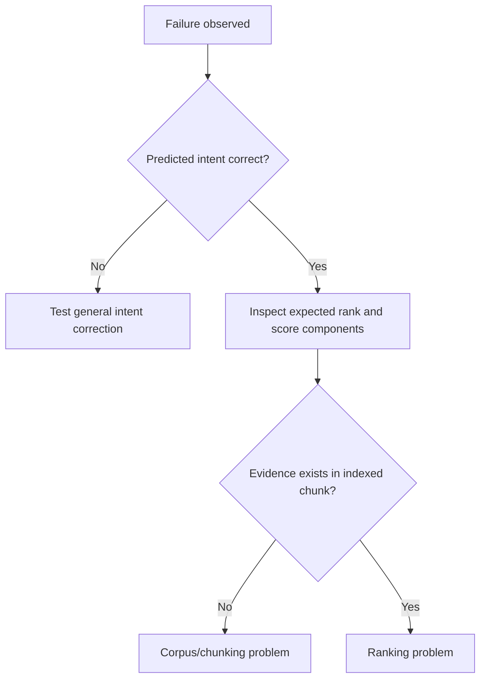
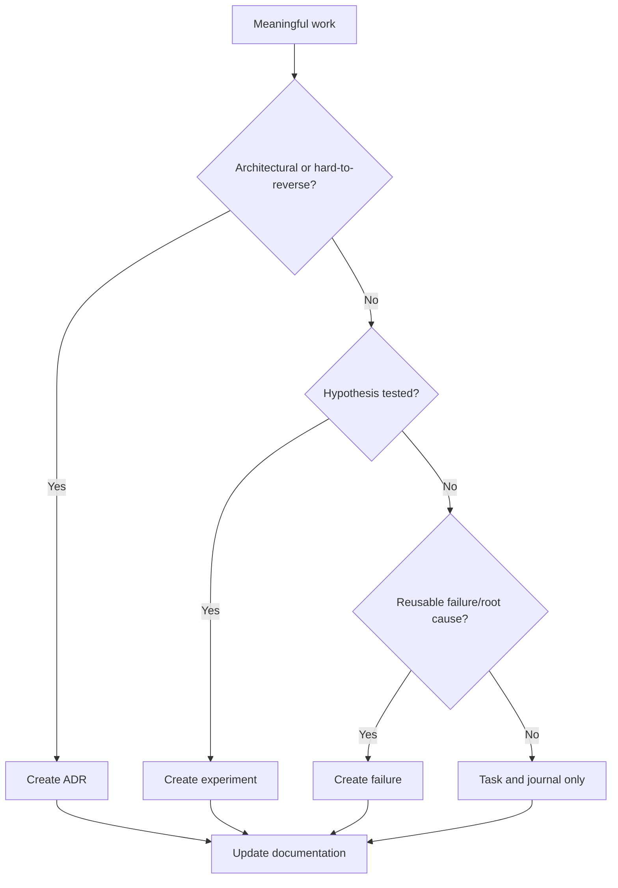

# Engineering Decision Tree

## Retrieval or intent?

## Ranking, aliases, and benchmark integrity

- Change a weight only after component decomposition, all-query modeling, and
  proof that a narrower signal cannot work.
- Add an alias only for general vocabulary evidence—not a golden ID, exact
  benchmark sentence, or one accepted path.
- Query-ID and target-path hacks are prohibited.
- Evaluator, matcher, golden, and gate manipulation cannot validate production.
- A regression is not silently acceptable; stop, narrow, or obtain explicit
  governance approval for a separately justified trade-off.

## Records

## Release readiness

A release requires exact scope, clean diff checks, proportional tests, canonical
metrics, protected-hash verification, known limitations, release documentation,
rollback conditions, and human approval. Evidence precedes architecture claims;
the smallest generalizable fix precedes broad tuning.
