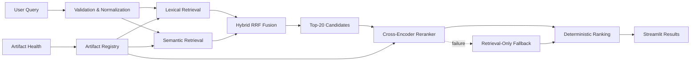

# AI & Search Intelligence Engineering Portfolio

End-to-end machine-learning and information-retrieval systems covering classification, semantic retrieval, hybrid search, cross-encoder reranking, statistical evaluation, artifact governance, runtime isolation, and interactive inference.

[Portfolio](https://mehmetcamofficial.com.tr/) · [LinkedIn](https://www.linkedin.com/in/mehmet-cam09/) · [GitHub](https://github.com/mehmetcamofficial)

`Python 3.12` `Streamlit` `scikit-learn` `PyTorch` `Transformers` `Search / Ranking` `51 Tests` `Research Portfolio`

---

### Featured result — Cross-Encoder Reranking

| Metric | Hybrid RRF | V5 Cross-Encoder | Change |
|---|---:|---:|---:|
| NDCG@10 | 0.6121 | 0.6785 | +0.0664 (+10.8%) |
| MRR | 0.7176 | 0.7720 | +0.0544 (+7.6%) |

Frozen 150-query holdout, candidate pool 20, paired NDCG@10 95% CI [0.0368, 0.0960]. 74 queries improved, 42 worsened. CPU local evaluation. **Not Production Promoted.**

---

## Search system evolution

| Version | Capability | Decision |
|---|---|---|
| V1 | TF-IDF + lexical features + Logistic Regression | Verified classification champion |
| V2 | Tree models and XGBRanker research | Not promoted |
| V2.1 | Repeated-seed robust evaluation | Historical research candidate |
| V3 | Semantic retrieval and Hybrid RRF | Best retrieval research candidate |
| V4 | End-to-end search pipeline and governance | Hybrid RRF retrieval-only selected |
| V5 | Cross-encoder reranking | Best reranking research candidate |

---

## Architecture



Key design properties: bounded candidate generation, separation of retrieval and reranking, lazy model loading, explicit fallback paths, metadata-first Registry and Artifact Health, and XGBoost worker isolation.

---

## Portfolio modules

| Project | Task | Core model | Evidence | Live |
|---|---|---|---|---|
| [Customer Churn Intelligence](01-machine-learning/customer-churn-prediction/) | Binary classification | Logistic Regression | ROC AUC 0.8440 | Batch inference |
| [Housing Value Forecasting](01-machine-learning/regression-project/) | Regression | Random Forest | RMSE 0.5121, R² 0.8087 | Single/batch inference |
| [Sentiment Intelligence](01-machine-learning/nlp-project/) | English NLP classification | MultinomialNB | Accuracy 0.8191, F1 0.8212 | Single/batch inference |
| [Trendyol Search Intelligence](01-machine-learning/trendyol-search-relevance/) | Relevance, ranking, retrieval, reranking | V1–V5 research pipeline | NDCG, MRR, Recall, bootstrap CI | Interactive Streamlit demo |

---

## Engineering principles

- **Deterministic evaluation** — Fixed seeds, pinned model revisions, bounded outputs
- **Group-safe splitting** — Complete `term_id` groups prevent train/evaluation leakage
- **Artifact fingerprints** — Registry reads actual paths and metrics; Health caches checksums
- **Immutable model revisions** — HuggingFace revisions, not mutable `latest` tags
- **Bounded outputs** — Smoke, medium, and full modes with explicit scope labels
- **Explicit fallback** — Every component degrades visibly rather than fabricating scores
- **Lazy model loading** — Models loaded per-page via `st.cache_resource`, not at startup
- **Worker isolation** — PyTorch and XGBoost runtimes in separate processes
- **No fabricated metrics** — Registry shows missing artifacts as unavailable, not retrained
- **Research governance** — Every candidate has a role, a decision, and a "Not Production Promoted" label

---

## Run locally

```bash
git clone https://github.com/mehmetcamofficial/turkiye-yapay-zeka-akademisi.git
cd turkiye-yapay-zeka-akademisi

python3.12 -m venv .venv
source .venv/bin/activate
python -m pip install --upgrade pip
python -m pip install -r 01-machine-learning/requirements.txt
```

Launch the portfolio:

```bash
./.venv/bin/python -m streamlit run \
  01-machine-learning/portfolio_app.py \
  --server.fileWatcherType none \
  --server.headless true
```

Run tests:

```bash
./.venv/bin/python -m pytest \
  01-machine-learning/trendyol-search-relevance/tests
```

No `PYTHONPATH` manipulation is required — `tests/conftest.py` handles project root resolution automatically.

---

## Repository structure

```
.
├── 01-machine-learning/
│   ├── portfolio/              # Streamlit app, registry, pages
│   ├── trendyol-search-relevance/  # V1–V5 search research
│   ├── customer-churn-prediction/
│   ├── regression-project/
│   └── nlp-project/
├── 02-data-science/            # Assignments and profiling
└── README.md
```

See the [Repository Guide](01-machine-learning/REPOSITORY_GUIDE.md) for full structure, reproducibility, and V1–V5 boundaries.

---

## Limitations and governance

The Streamlit experience is a portfolio application, not evidence of commercial production traffic. Trendyol results use a public competition snapshot and bounded candidates; they do not establish online search impact, fairness, causal business value, or catalogue-wide retrieval quality. Every experimental candidate is labeled with its research role and a "Not Production Promoted" decision.

## Author

[Mehmet Cam](https://www.linkedin.com/in/mehmet-cam09/) — AI engineer focused on search relevance, ranking systems, and reproducible ML evaluation.
