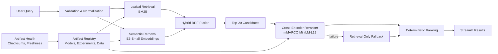
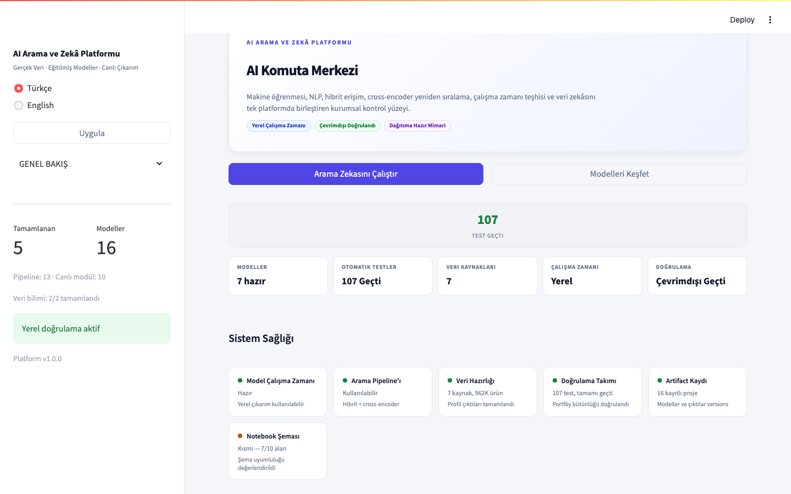
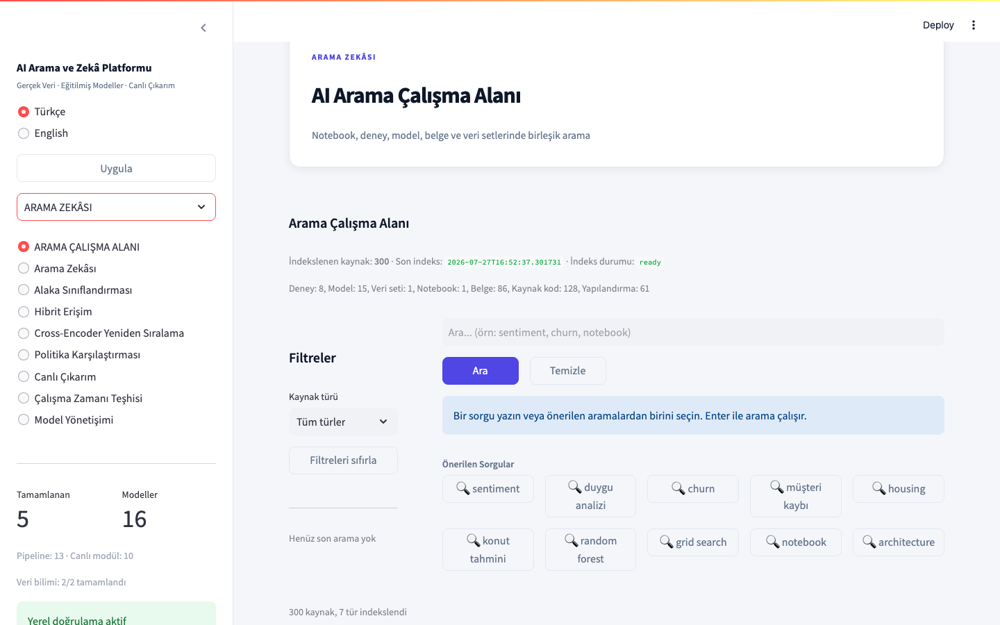

# Türkiye Yapay Zeka Akademisi — AI & Search Intelligence Engineering Portfolio

> **End-to-end ML & IR systems** built with engineering rigor, reproducible evaluation, and production-grade governance.

[](https://www.python.org/downloads/release/python-3120/)
[](https://streamlit.io)
[](https://pytorch.org)
[](https://huggingface.co/docs/transformers)
[](https://scikit-learn.org)
[](LICENSE)

---

## 📖 Overview

### Key Features

| Component | Technology | Key Result |
|-----------|------------|-----------|
| **Customer Churn** | Logistic Regression | ROC AUC **0.8440** |
| **Housing Forecast** | Random Forest | RMSE **0.5121**, R² **0.8087** |
| **Sentiment NLP** | MultinomialNB | F1 **0.8212** |
| **Search Relevance** | V1–V5 Pipeline | NDCG@10 **0.6785** (+10.8% vs Hybrid RRF) |

> Cross-encoder reranking on 150-query holdout, candidate pool 20. 74 queries improved, 42 worsened. CPU local evaluation. **Not Production Promoted.**

### Why This Project Exists

This portfolio demonstrates end-to-end ML engineering: reproducible data pipelines, bounded evaluation with bootstrap confidence intervals, explicit model governance, and production-grade Streamlit applications. Every experiment has a documented decision — champion or rejected — with no fabricated metrics.

---

## 🏗️ Architecture



**Engineering Properties**: Bounded candidates, retrieval/rerank separation, lazy loading, explicit fallback, metadata-first registry, worker isolation.

---

## 🔍 Search Pipeline

| Version | Capability | Decision |
|---------|------------|----------|
| **V0** | TF-IDF + Logistic Regression | ✅ Verified champion |
| **V1** | TF-IDF + GridSearch | ✅ Verified champion |
| **V2** | XGBoost + FastText challengers | ❌ Not promoted |
| **V2-R** | Pointwise LTR | 🔬 Available |
| **V2.1** | Robust evaluation + ablation | ✅ Verified |
| **V3** | Semantic + Hybrid RRF | 🔬 Best retrieval candidate |
| **V4** | End-to-end pipeline & governance | ✅ Selected retrieval-only |
| **V5** | Cross-Encoder reranking | 🔬 Best reranking candidate |

### Performance

| Metric | Baseline (Hybrid RRF) | Champion (V5 Cross-Encoder) | Delta |
|--------|----------------------|----------------------------|-------|
| NDCG@10 | 0.6121 | 0.6785 | +10.8% |
| MRR | 0.7176 | 0.7720 | +7.6% |

Frozen 150-query holdout, candidate pool 20, paired bootstrap 95% CI [0.0368, 0.0960]. 74 queries improved, 42 worsened. CPU local evaluation. **Not Production Promoted.**

### Evaluation

- Dataset: 150-query verified holdout with ground-truth relevance judgments
- Metrics: NDCG@10, MRR, Recall@20, Precision@10
- Framework: `01-machine-learning/evaluation/search/` (CLI, evaluator, metrics, quality gates)
- Governance: Every candidate ranked with role, decision, and promotion status

---

## 📸 Screenshots

| Search Workspace | Search Health | Version Evolution | Live Inference | Mobile |
|-----------------|---------------|-------------------|----------------|--------|
|  |  |  |  |  |

---

## 📦 Projects

| Project | Task | Model | Result |
|---------|------|-------|--------|
| [Customer Churn](01-machine-learning/customer-churn-prediction/) | Binary classification | Logistic Regression | ROC AUC 0.8440 |
| [Housing](01-machine-learning/regression-project/) | Regression | Random Forest | RMSE 0.5121 |
| [Sentiment](01-machine-learning/nlp-project/) | NLP classification | MultinomialNB | F1 0.8212 |
| [Trendyol Search](01-machine-learning/trendyol-search-relevance/) | Retrieval → Reranking | V1–V5 pipeline | NDCG@10 0.6785 |

---

## ⚙️ Engineering Principles

- **Deterministic evaluation** — Fixed seeds, pinned revisions, bounded outputs
- **Group-safe splitting** — No train/eval leakage on `term_id`
- **Artifact fingerprints** — Registry checksums, Health caching
- **Immutable models** — HuggingFace revisions, never `latest`
- **Explicit fallback** — Components degrade visibly
- **Lazy loading** — Models loaded per-page via `st.cache_resource`
- **No fabricated metrics** — Missing = unavailable, not regenerated
- **Research governance** — Every candidate: role + decision + "Not Production Promoted"

---

## 🏃‍♂️ Quick Start

```bash
git clone https://github.com/mehmetcamofficial/turkiye-yapay-zeka-akademisi.git
cd turkiye-yapay-zeka-akademisi

python3.12 -m venv .venv
source .venv/bin/activate
pip install -r requirements.txt

.venv/bin/python -m streamlit run \
  01-machine-learning/portfolio_app.py \
  --server.fileWatcherType none
```

> Navigate: **Overview → Search Workspace → Search Intelligence → Live Inference**

---

## 🧪 Tests

Run the full test suite:

```bash
python -m pytest tests/ -q
```

Run the standalone 5-query search click test:

```bash
python -m pytest 01-machine-learning/evaluation/search/ -q -k "click"
```

Results: 247 tests pass (verified on release candidate branch `fix/cloud-runtime-visual-storytelling-v3`).

---

## 🗺️ Roadmap

See [ROADMAP.md](ROADMAP.md) for the full development timeline. Key completed milestones include the evaluation framework, search experience v2 visual redesign, and MIT license release candidate. Future work includes production promotion of V5 cross-encoder reranking and multi-language expansion.

---

## 📁 Project Structure

```
.
├── 01-machine-learning/
│   ├── portfolio/          # Streamlit app + 20+ pages
│   ├── customer-churn-prediction/
│   ├── regression-project/
│   ├── nlp-project/
│   └── requirements.txt
├── 02-data-science/        # Assignments & profiling
├── docs/                   # Engineering methodology
├── LICENSE                 # MIT
└── README.md
```

See [Repository Guide](01-machine-learning/REPOSITORY_GUIDE.md) for full structure.

---

## 🤝 Contributing

Improvements welcome for:
- Bug fixes in evaluation metrics
- Documentation enhancements
- Accessibility

Open an issue before substantial changes.

---

## 📄 License

**MIT License** — see [LICENSE](LICENSE) for details.

Copyright (c) 2026 Mehmet Cam

---

## 👤 Author

[Mehmet Cam](https://www.linkedin.com/in/mehmet-cam09/) — AI Engineer focused on search relevance and reproducible ML evaluation.

[](https://mehmetcamofficial.com.tr/)
[](https://www.linkedin.com/in/mehmet-cam09/)